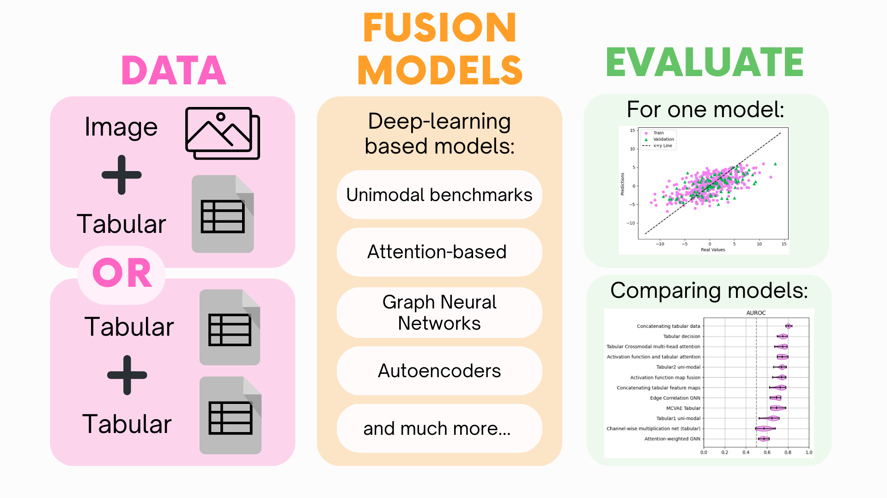

.. fusilli documentation master file, created by sphinx-quickstart on Wed Aug 16 12:33:29 2023. You can adapt this file completely to your liking, but it should at least contain the root `toctree` directive.

fusilli
======================================================

Don't be silly, use fusilli! 🍝
---------------------------------

**Welcome to fusilli!**
Have you got multimodal data but not sure how to combine them for your machine learning task? Look no further!
This library provides a way to compare different fusion methods for your multimodal data.

-----

Why would you want to use fusilli?
##################################

.. list-table::
    :widths: 50 50
    :header-rows: 1

    * - Problem
      - Solution
    * - You have a dataset that contains multiple modalities. 🩻 📈
      - Either two types of tabular data or one type of tabular data and one type of image data. Ever thought that maybe they'd be more powerful together? Fusilli can help you find out if multimodal fusion is right for you! ✨
    * - You've looked at methods for multimodal fusion and thought "wow, that's a lot of code" and "wow, there are so many names for the same concept". 🤔 🆘
      - *So* relatable. Fusilli provides a simple way for comparing multimodal fusion models without having to trawl through Google Scholar! ✨
    * - You've found a multimodal fusion method that you want to try out, but you're not sure how to implement it or it's not quite right for your data. 😵‍💫 🙌
      - Fusilli allows the users to modify existing methods, such as changing the architecture of the model, and provides templates for implementing new methods! ✨

-----

.. toctree::
   :maxdepth: 1
   :caption: 🌸 Getting Started 🌸

   introduction
   fusion_model_explanations
   installation
   data_loading
   experiment_setup
   quick_start

-----

.. toctree::
   :maxdepth: 1
   :caption: 🌸 Further Guidance 🌸

   choosing_model
   modifying_models
   customising_training
   logging_with_wandb
   glossary

-----

.. toctree::
   :maxdepth: 2
   :caption: 🌸 Tutorials 🌸

   auto_examples/training_and_testing/index
   auto_examples/model_comparison/index
   auto_examples/customising_behaviour/index

-----

.. toctree::
   :maxdepth: 2
   :caption: 🌸 Contributing 🌸

   developers_guide
   contributing_examples/index

-----

🌸 API Reference 🌸
-------------------

.. autosummary::
   :toctree: autosummary
   :recursive:
   :caption: 🌸 API Reference 🌸

   fusilli.fusionmodels
   fusilli.data
   fusilli.train
   fusilli.eval
   fusilli.utils

-----

Indices and tables
==================

* :ref:`genindex`
* :ref:`modindex`
* :ref:`search`

.. role:: underline
    :class: underline
