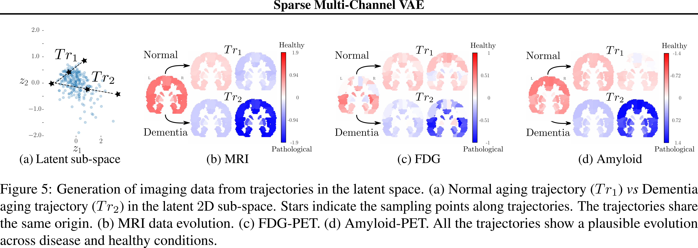
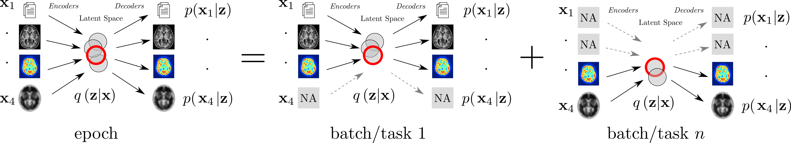

# MultiChannel VAE

The MultiChannel VAE (MCVAE) is an extension of the variational autoencoder able to jointly model multiple data source that here we name *channels*.


This repository contains the code related to two papers.

## [Sparse] MCVAE

In this paper we present the MCVAE along with an option to have a __sparse__ latent representation.

Working examples can be found under [`examples/mcvae`](https://github.com/ggbioing/mcvae/tree/master/examples/mcvae)



If you use this work, please cite:

*Sparse Multi-Channel Variational Autoencoder for the Joint Analysis of Heterogeneous Data*

by Luigi Antelmi, Nicholas Ayache, Philippe Robert, Marco Lorenzi.

[[paper]](http://proceedings.mlr.press/v97/antelmi19a.html)
[[slides]](https://icml.cc/media/Slides/icml/2019/hallb(12-16-00)-12-17-00-5118-sparse_multi-ch.pdf)
[[video]](https://videoken.com/embed/n5e2qNQ-h6E?tocitem=67)

BibTeX citation:
```bibtex
@inproceedings{Antelmi2019,
author = {Antelmi, Luigi and Ayache, Nicholas and Robert, Philippe and Lorenzi, Marco},
booktitle = {Proceedings of the 36th International Conference on Machine Learning},
editor = {Chaudhuri, Kamalika and Salakhutdinov, Ruslan},
pages = {302--311},
publisher = {PMLR},
title = {{Sparse Multi-Channel Variational Autoencoder for the Joint Analysis of Heterogeneous Data}}, 
year = {2019}
}
```

## Multi-Task MCVAE

We extend the capabilities of the MCVAE with a Multi-Task approach
allowing to model datasets with missing observations.



Working examples can be found under [`examples/mt-mcvae`](https://github.com/ggbioing/mcvae/tree/master/examples/mt-mcvae)

[[paper]](https://hal.inria.fr/hal-03114888/file/elsarticle-template-harv.pdf)

BibTeX citation:
```bibtex
@unpublished{antelmi:hal-03114888,
  title = {{Combining Multi-Task Learning and Multi-Channel Variational Auto-Encoders to Exploit Datasets with Missing Observations -Application to Multi-Modal Neuroimaging Studies in Dementia}},
  author = {Antelmi, Luigi and Ayache, Nicholas and Robert, Philippe and Ribaldi, Federica and Garibotto, Valentina and Frisoni, Giovanni B and Lorenzi, Marco},
  url = {https://hal.inria.fr/hal-03114888},
  note = {working paper or preprint},
  year = {2021},
  month = Jan,
  pdf = {https://hal.inria.fr/hal-03114888/file/elsarticle-template-harv.pdf},
  hal_id = {hal-03114888},
  hal_version = {v1},
}
```

# Installation

## Quick and dirty
Clone this repo and add the following preamble to your python script by changing appropriately the path to the `mcvae/src` folder: 
```python
import sys
sys.path.append('/home/user/git/mcvae/src')
```
 Errors may arise while using the `mcvae` package if your python environment does not contain the dependencies listed in the [`environment.yml`](./environment.yml) file. 

## GNU/Linux
Install conda:
```bash
wget https://repo.anaconda.com/miniconda/Miniconda3-latest-Linux-x86_64.sh  
bash Miniconda3-latest-Linux-x86_64.sh
```

Download this github repository and move into in:
```bash
git clone git://gitlab.inria.fr/epione_ML/mcvae
cd mcvae
```

Install the customized python environment:
```bash
conda env create -f environment.yml
```

Activate the python environment:
```bash
conda activate mcvae
```

Install the mcvae package:
```bash
python setup.py install
```

An alternative to the last point is to install the package in "develop" mode.
Using this mode, all local modifications of source code will be considered in your Python interpreter (when restarted) without having to install the package again.
This is particularly useful when adding new features.
To install this package in develop mode, type the following command line:
```bash
python setup.py develop
```

## Windows
Download and install conda from: https://docs.conda.io/en/latest/miniconda.html

Download this github repository from: https://gitlab.inria.fr/epione_ML/mcvae

Open the Anaconda prompt and move into the github repository previously downloaded.

Deactivate the base environment:
`conda deactivate`

Install the customized python environment:
`conda env create -f environment.yml`

Activate the python environment:
`conda activate mcvae`

Install the mcvae package:
`python setup.py install`

An alternative to the last point is to install the package in "develop" mode.
Using this mode, all local modifications of source code will be considered in your Python interpreter (when restarted) without having to install the package again.
This is particularly useful when adding new features.
To install this package in develop mode, type the following command line:
`python setup.py develop`
